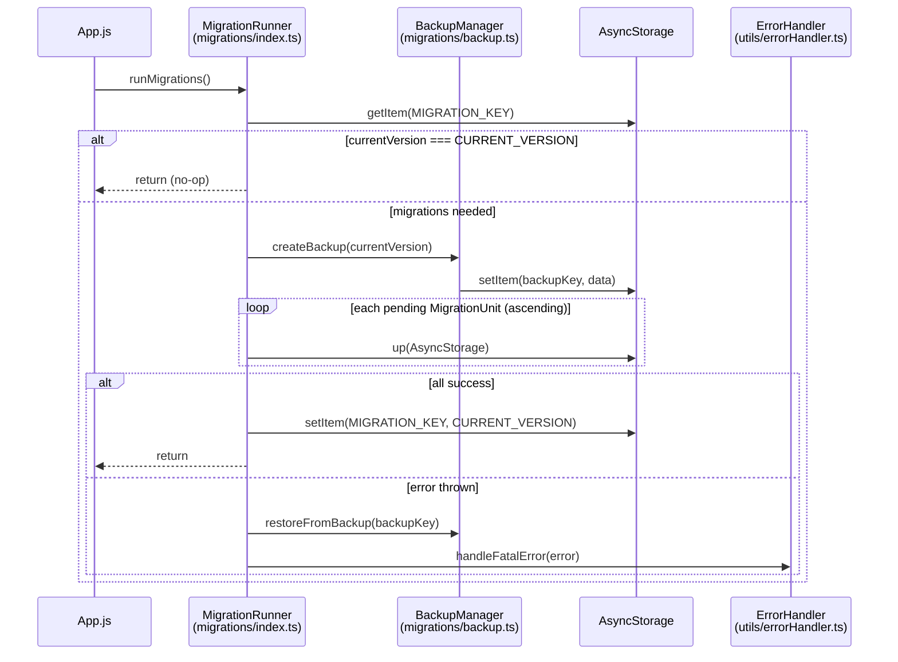

# Design Document: migration-system

## Overview

An-Q クイズアプリの AsyncStorage データマイグレーションシステムを設計する。
アプリ起動時に自動的にスキーマバージョンを確認し、未適用のマイグレーションを順次実行する。
既存の `schema.ts` と `backup.ts` を基盤として、`MigrationRunner`・個別 `MigrationUnit`・`ErrorHandler` を追加実装する。

### 設計原則

- **冪等性**: バージョン番号管理により、同じマイグレーションを二度実行しない
- **安全性**: マイグレーション前に必ずバックアップを作成し、失敗時は自動復元する
- **拡張性**: 新しいマイグレーションを配列に追加するだけで動作する構造
- **プラットフォーム**: Expo Web ビルドを対象とするため、`window.location.reload()` を使用

---

## Architecture



### ファイル構成

```
d:\JS\
├── App.js                                  (修正) useEffect で runMigrations 呼び出し追加
├── app/
│   ├── migrations/
│   │   ├── schema.ts                       (既存) バージョン定数・キー定義
│   │   ├── backup.ts                       (既存) バックアップ管理
│   │   ├── index.ts                        (新規) MigrationRunner エントリポイント
│   │   └── migrations/
│   │       ├── 001_initial.ts              (新規) v1 初期スキーマ
│   │       └── 002_annotations.ts          (新規) v2 アノテーションフィールド追加
│   └── utils/
│       └── errorHandler.ts                 (新規) エラーハンドリングユーティリティ
```

---

## Components and Interfaces

### MigrationUnit インターフェース

```typescript
interface MigrationUnit {
  version: number;
  up(storage: typeof AsyncStorage): Promise<void>;
}
```

各マイグレーションファイルはこのインターフェースに準拠したオブジェクトをデフォルトエクスポートする。

### MigrationRunner (`app/migrations/index.ts`)

```typescript
export const runMigrations = async (): Promise<void> => {
  // 1. 現在バージョンを取得
  // 2. CURRENT_VERSION と一致すれば早期終了
  // 3. バックアップ作成
  // 4. 未適用マイグレーションを昇順に実行
  // 5. 成功時: db_version を CURRENT_VERSION に更新
  // 6. 失敗時: restoreFromBackup → handleFatalError
};
```

### ErrorHandler (`app/utils/errorHandler.ts`)

```typescript
export enum ErrorLevel {
  INFO = 'INFO',
  WARNING = 'WARNING',
  FATAL = 'FATAL',
}

export const showUserError = (message: string, level: ErrorLevel): void => { ... };
export const handleFatalError = (error: unknown): void => { ... };
```

### MigrationUnit v1 (`app/migrations/migrations/001_initial.ts`)

```typescript
const migration001: MigrationUnit = {
  version: 1,
  async up(storage) {
    const existing = await storage.getItem('quiz_questions');
    if (existing === null) {
      await storage.setItem('quiz_questions', JSON.stringify([]));
    }
  },
};
export default migration001;
```

### MigrationUnit v2 (`app/migrations/migrations/002_annotations.ts`)

```typescript
const migration002: MigrationUnit = {
  version: 2,
  async up(storage) {
    const raw = await storage.getItem('quiz_questions');
    if (!raw) return;
    const questions: Question[] = JSON.parse(raw);
    const updated = questions.map(q => ({
      ...q,
      imageAnnotations: q.imageAnnotations ?? [],
      isShared: q.isShared ?? false,
      createdAt: typeof q.createdAt === 'string'
        ? new Date(q.createdAt).getTime()
        : q.createdAt,
    }));
    await storage.setItem('quiz_questions', JSON.stringify(updated));
  },
};
export default migration002;
```

---

## Data Models

### StorageState (マイグレーション前後のスキーマ)

**バージョン 0 → 1（初期化）**

| キー | バージョン0 | バージョン1 |
|------|-------------|-------------|
| `quiz_questions` | undefined | `[]` |

**バージョン 1 → 2（アノテーション追加）**

| フィールド | バージョン1 | バージョン2 |
|-----------|-------------|-------------|
| `imageAnnotations` | なし（undefined） | `[]`（デフォルト） |
| `isShared` | なし（undefined） | `false`（デフォルト） |
| `createdAt` | `string` または `number` または `undefined` | `number` または `undefined` |

### Backup オブジェクト（既存 backup.ts より）

```typescript
interface Backup {
  timestamp: number;
  version: number;
  data: Record<string, string>; // MIGRATION_TARGETS のスナップショット
}
```

---

## Correctness Properties

*A property is a characteristic or behavior that should hold true across all valid executions of a system — essentially, a formal statement about what the system should do. Properties serve as the bridge between human-readable specifications and machine-verifiable correctness guarantees.*

### Property 1: v1 マイグレーションが quiz_questions を初期化する

*For any* ストレージ状態で `quiz_questions` キーが存在しない場合、v1 マイグレーションを実行すると `quiz_questions` の値が空配列 `[]` になる

**Validates: Requirements 1.1**

### Property 2: v1 マイグレーションが既存データを保持する

*For any* 有効な Question 配列が `quiz_questions` に保存されている場合、v1 マイグレーションを実行した後も配列の内容は変化しない

**Validates: Requirements 1.2**

### Property 3: v2 マイグレーションが全 Question にデフォルトフィールドを追加する

*For any* Question 配列において、v2 マイグレーションを実行した後、すべての Question オブジェクトは `imageAnnotations` が配列型であり、`isShared` が boolean 型である

**Validates: Requirements 2.1, 2.2**

### Property 4: v2 マイグレーションが createdAt を number 型に変換する

*For any* Question 配列において、v2 マイグレーションを実行した後、`createdAt` フィールドが存在するすべての Question の `createdAt` は number 型である

**Validates: Requirements 2.3**

### Property 5: 最新バージョンでは runMigrations が何も実行しない

*For any* ストレージ状態で `db_version` が `CURRENT_VERSION` と等しい場合、`runMigrations()` を呼び出しても、いかなる MigrationUnit の `up()` も呼び出されない

**Validates: Requirements 3.2, 7.1**

### Property 6: バックアップはマイグレーションより先に作成される

*For any* 未適用のマイグレーションが存在する場合、`runMigrations()` はいかなる MigrationUnit の `up()` を呼び出す前に `createBackup()` を呼び出す

**Validates: Requirements 3.3**

### Property 7: 未適用マイグレーションのみ昇順で実行される

*For any* 開始バージョン `v`（0 ≦ v < CURRENT_VERSION）において、`runMigrations()` は `version > v` を持つ MigrationUnit のみをバージョン番号の昇順で実行する

**Validates: Requirements 3.4, 7.2**

### Property 8: 成功後に db_version が更新され、次回実行は無操作になる

*For any* 開始バージョン `v < CURRENT_VERSION` において、`runMigrations()` が成功した後は `db_version === CURRENT_VERSION` であり、再度 `runMigrations()` を呼び出しても MigrationUnit の `up()` は一切呼び出されない

**Validates: Requirements 3.5, 7.3**

### Property 9: マイグレーション失敗時は常にロールバックと handleFatalError が呼ばれる

*For any* エラーをスローする MigrationUnit に対して、`runMigrations()` は `restoreFromBackup()` を呼び出した後、復元の成否にかかわらず `handleFatalError()` を呼び出す

**Validates: Requirements 4.1, 4.2, 4.3**

### Property 10: showUserError が ErrorLevel に応じた console メソッドを呼ぶ

*For any* メッセージ文字列と ErrorLevel 値の組み合わせに対して、`showUserError()` は `ErrorLevel.FATAL` の場合 `console.error`、`ErrorLevel.WARNING` の場合 `console.warn`、`ErrorLevel.INFO` の場合 `console.info` を呼び出す

**Validates: Requirements 5.2**

### Property 11: handleFatalError は任意のエラーに対して常にログ出力とリロードを行う

*For any* エラーオブジェクトに対して、`handleFatalError()` は `console.error` を呼び出し、かつ `window.location.reload()` を呼び出す

**Validates: Requirements 5.3**

---

## Error Handling

### エラー分類

| 状況 | レベル | 処置 |
|------|--------|------|
| バックアップ作成失敗 | FATAL | マイグレーション中断、`handleFatalError` 呼び出し |
| MigrationUnit.up() 失敗 | FATAL | `restoreFromBackup` → `handleFatalError` |
| バックアップ復元失敗 | FATAL | `handleFatalError`（データが壊れている可能性） |
| `db_version` 読み取り失敗 | FATAL | バージョン `0` として扱い、全マイグレーション実行 |

### ロールバックフロー

```
migration failure
    └─ restoreFromBackup(backupKey)
          ├─ success → handleFatalError(error)  // アプリ再起動を促す
          └─ failure → handleFatalError(error)  // 同上（データ破損の可能性を伝える）
```

`handleFatalError` は Expo Web 環境において `window.location.reload()` を呼び出してアプリを再起動する。
これによりユーザーは次回起動時に再度マイグレーションを試みる（復元成功の場合）か、
または開発者がデータを手動修復するまで待つ（復元失敗の場合）。

---

## Testing Strategy

### デュアルテスト方針

- **プロパティテスト**: 上記 Correctness Properties をカバーするユニバーサルプロパティ検証
- **ユニットテスト**: 具体的な例、エッジケース、統合ポイントの検証

### プロパティテストライブラリ

TypeScript / Expo Web 環境のため **[fast-check](https://fast-check.dev/)** を使用する。

```bash
npm install --save-dev fast-check
```

### テスト設定

```typescript
// jest.config.js または jest 設定
// fast-check デフォルト: numRuns=100 per property
```

各プロパティテストのタグ形式:
```
Feature: migration-system, Property N: <property_text>
```

### プロパティテスト一覧

| Property | テスト対象 | 入力生成 |
|---------|-----------|---------|
| P1 | v1: quiz_questions 未存在時の初期化 | 空ストレージ状態 |
| P2 | v1: 既存データ保持 | ランダム Question 配列 |
| P3 | v2: imageAnnotations・isShared デフォルト追加 | ランダム Question 配列（フィールドあり/なし混在） |
| P4 | v2: createdAt string→number 変換 | createdAt が string/number/undefined のランダム Question |
| P5 | runMigrations: 最新バージョンで no-op | CURRENT_VERSION が設定されたストレージ |
| P6 | runMigrations: バックアップ優先順序 | バージョン 0 または 1 のストレージ |
| P7 | runMigrations: 昇順フィルタリング実行 | ランダムな開始バージョン（0〜CURRENT_VERSION-1） |
| P8 | runMigrations: 冪等性 | 任意の開始バージョン |
| P9 | runMigrations: 失敗時ロールバック | エラーをスローする MigrationUnit |
| P10 | showUserError: ErrorLevel 対応 console メソッド | ランダム文字列 × 全 ErrorLevel |
| P11 | handleFatalError: ログ＋リロード | ランダムエラーオブジェクト |

### ユニットテスト一覧

- v2 マイグレーション: `quiz_questions` 未存在時に何もしない（エッジケース 2.4）
- `runMigrations`: バックアップ作成失敗時にマイグレーション実行を中断（エッジケース 4.4）
- `App.js`: マウント時に `runMigrations` が呼ばれる（統合 6.1）
- `App.js`: 成功後に通常画面を表示（例 6.2）
- `App.js`: 失敗時に `handleFatalError` を呼ぶ（例 6.3）
- `MIGRATIONS` 配列のバージョンが昇順であること（例 8.3）
